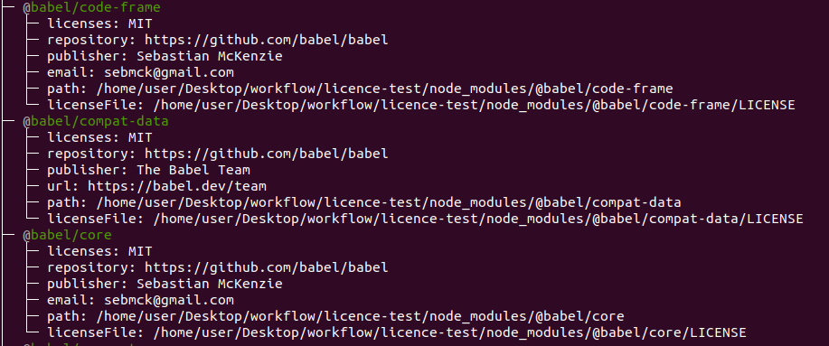
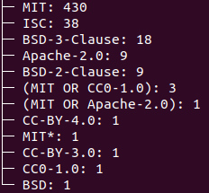

# Репозиторий для тестов библиотек лицензирования

## Задачи для библиотек
 - Проверка наличия лицензии у модуля
 - Нахождение дубликатов

## Библиотеки для сравнения: 
 - [license-checker](https://www.npmjs.com/package/license-checker)
 - [legally](https://www.npmjs.com/package/legally)
 - [npm-license-crawler](https://www.npmjs.com/package/npm-license-crawler)

### Комманда для установки пакета(глобально):
```bash
npm install -g license-checker
```

### При использовании команды в корневом каталоге выведет все устанволенные зависимости и информацию о них(тип лецензии, ссылку на репо модуля, имя владельца, эмейл, путь к репо, путь к файлу лецензии)
```bash
license-checker
```


### Чтобы вывести количество лицензий который используются в проекте необходимо ввести:
```bash
license-checker --summary
```



additional links
 - https://medium.com/@fokusman/the-easiest-way-to-check-all-your-npm-dependency-licenses-753075ef1d9d
 - https://blog.bitsrc.io/how-i-analyzed-all-npm-dependency-licenses-in-one-go-18de0f7244bc
 - https://medium.com/@vovabilonenko/licenses-of-npm-dependencies-bacaa00c8c65